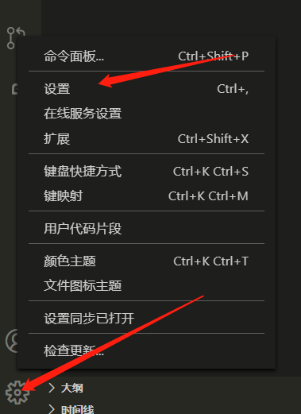
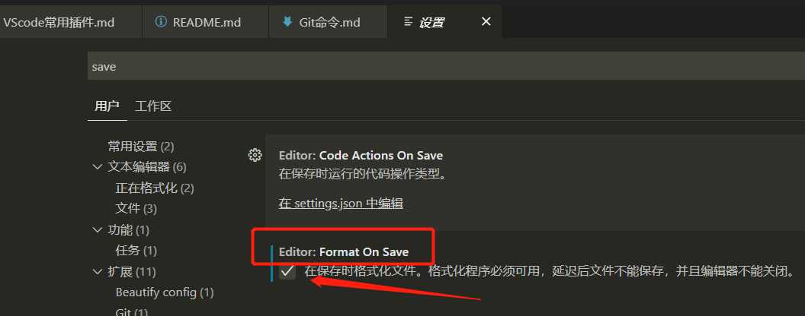

## vscode 常用插件

- Chinese:中文语言包（输入 Chinese 就可以找到）
- Terminal: 安装完后, 右键代码, 选择 "Open in integrated Terminal" 方便打开
- Code Runner:运行选中代码段（支持大量语言，包括 Nodejs）
- npm:运行 npm 命令
- npm Intellisense:导入模块时，提示已安装模块名称
- Bracket Pair Colorizer:代码对着色器
- Code Spell Checker:代码拼写检查器
- Setting Sync（或者登陆 GitHub 账号进行同步:同步 VSCode 设置（插件同步到别的电脑）

### 格式化代码:

```
1.Beautify:格式化代码-html ,js,css
2.Prettier:格式化代码-JavaScript / TypeScript / CSS
```

- ★ 安装 Prettier 后在 vscode 设置保存后自动格式化：点击设置
  <br />
  在搜索框输入 Format 或者 save，找到：Editor: Format On Save，将复选框踢 √<br /><br />
  

### 前端开发常用插件

- Vetur:语法高亮，智能提示，emmet，错误提示，格式化，自动补全，debugger;vscode 官方钦定 Vue 插件，Vue 开发者必备。
- JavaScript (ES6) snippets:支持 JavaScript ES6 语法
- ESLint:js 语法纠错
- HTML CSS Support:智能提示 CSS 类名以及 id
- jQuery Code Snippets:jQuery 代码智能提示
- JavaScript (ES6) code snippets in StandardJS style:Javascript (ES6)代码片段
- open in browser:该插件支持快捷键与鼠标右键快速在浏览器中打开 html 文件
- Path Intellisense:自动提示文件路径，支持各种快速引入文件
- vscode-icons:目录图标主题
- Auto Close Tag:自动闭合 HTML 标签
